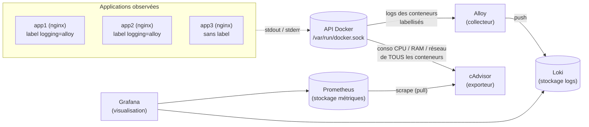

# 06 — Observabilité d'une stack Compose : logs & métriques

> **Scénario à réaliser en autonomie.** Vous construisez pas à pas une stack d'observabilité
> autour de trois petites applications : vous complétez vous-même les blocs marqués `# TODO`,
> et le dossier [`solution/`](solution/) ne sert qu'en dernier recours (en cas de blocage 😉).
>
> **Niveau :** débutant en observabilité. **Prérequis :** vous savez écrire un `compose.yml`
> (services, `ports`, `volumes`, `labels`) et lancer `docker compose up -d` / `logs` / `down`.
> Aucune connaissance de Loki, Prometheus ou Grafana n'est supposée. **Durée :** ~1 h 30.

## ✨ Objectifs

- Comprendre la différence entre **logs** et **métriques**, et l'outil qui gère chacun.
- Centraliser les logs de conteneurs choisis avec **Grafana Alloy => Loki**.
- Collecter les métriques des conteneurs avec **cAdvisor => Prometheus**.
- Explorer le tout dans **Grafana** : requêtes LogQL / PromQL, puis un dashboard importé.

---

## 🗺️ L'architecture visée

Avant de taper la moindre ligne, voici ce que vous allez assembler. Deux chaînes indépendantes
— une pour les **logs**, une pour les **métriques** — se rejoignent dans Grafana :



Pourquoi ce découpage ? Parce que logs et métriques ne répondent pas à la même question, et ne
se stockent pas de la même façon :

| | **Logs** | **Métriques** |
|---|---|---|
| Question | *« Que s'est-il passé ? »* (une requête 404, une stack trace) | *« Combien / à quel rythme ? »* (CPU 80 %, 12 req/s) |
| Forme | des lignes de texte horodatées | des nombres échantillonnés dans le temps |
| Collecte | **push** : Alloy lit et *envoie* à Loki | **pull** : Prometheus *va chercher* chez cAdvisor |
| Stockage | **Loki** | **Prometheus** |
| Langage de requête | **LogQL** | **PromQL** |

> ⚖️ **Deux époques pour la collecte de logs.** Vous croiserez beaucoup de tutos avec
> **Promtail** : c'est l'agent historique de Loki… mais il est **en fin de vie depuis le
> 2 mars 2026** (plus aucune mise à jour). Son successeur est **Grafana Alloy**, un collecteur
> unique qui gère logs, métriques et traces. On utilise donc Alloy ; Promtail reste en bonus
> pour comparer.
>
> | | Promtail (classique) | Alloy (aujourd'hui) |
> |---|---|---|
> | Statut | EOL (02/03/2026) | maintenu, recommandé |
> | Périmètre | logs => Loki uniquement | logs, métriques, traces (OpenTelemetry) |
> | Config | YAML | langage « Alloy » (blocs `composant "nom" { … }`) |
> | Interface web | non | oui (graphe des composants, port 12345) |
>
> 📖 [Promtail EOL](https://grafana.com/docs/loki/latest/send-data/promtail/) ·
> [Grafana Alloy](https://grafana.com/docs/alloy/latest/)

---

## 🖥️ Accéder aux interfaces (lab hébergé ou poste local)

Vous allez ouvrir plusieurs interfaces web (Grafana, Prometheus, Alloy). Selon votre environnement :

| Interface | Port | **Lab hébergé** (VS Code dans le navigateur) | **Poste local** |
|---|---|---|---|
| Grafana | 3030 | `https://labN-3030.<domaine-du-lab>` | http://localhost:3030 |
| Prometheus | 9090 | `https://labN-9090.<domaine-du-lab>` | http://localhost:9090 |
| Alloy (UI) | 12345 | `https://labN-12345.<domaine-du-lab>` | http://localhost:12345 |
| app1 / app2 / app3 | 8081-8083 | `https://labN-8081.<domaine-du-lab>` … | http://localhost:8081 … |

`N` est le numéro de votre poste (ex. `lab3-3030.…` pour le poste 3). Au premier accès à chaque
sous-domaine, le mot de passe de votre poste est demandé : c'est le même que pour VS Code. Dans
le **terminal**, `curl localhost:<port>` fonctionne partout.

> ⚠️ **Dans le lab hébergé, n'utilisez pas `/proxy/3030/` pour Grafana.** Ce chemin sert l'app
> *sous un préfixe*, or Grafana génère ses liens à la racine (`<base href="/">`) : vous
> obtiendriez une page blanche. Le sous-domaine `labN-3030` sert l'app à la racine, donc tout
> fonctionne. *(L'onglet **PORTS** de VS Code propose directement ces liens.)*

---

## 📁 Point de départ

Vous partez d'un dossier vide. Voici l'arborescence que vous aurez **à la fin du lab** ; chaque
fichier est créé dans la section indiquée :

```
obs-lab/
├── compose.yml                  # sections 0 à 3 (il grandit à chaque étape)
└── config/
    ├── grafana-datasources.yml  # section 1
    ├── config.alloy             # section 2
    └── prometheus.yml           # section 3
```

---

## 🚀 0 — Mise en place : trois applications à observer

Il faut d'abord quelque chose à observer. On démarre trois serveurs nginx identiques. Seule
différence : **app1 et app2 portent un label** `logging: "alloy"`, app3 non. Ce label servira
de filtre en section 2, pour montrer qu'on choisit ce qu'on collecte.

Créez le dossier de travail et son sous-dossier `config/` :

```bash
mkdir -p ~/obs-lab/config && cd ~/obs-lab
```

Créez ensuite `~/obs-lab/compose.yml` avec ce contenu (complet, rien à compléter ici) :

```yaml
services:
  app1:
    image: nginx:1.29-alpine
    ports: ["127.0.0.1:8081:80"]
    labels:
      logging: "alloy"          # -> Alloy collectera les logs de ce conteneur
  app2:
    image: nginx:1.29-alpine
    ports: ["127.0.0.1:8082:80"]
    labels:
      logging: "alloy"
  app3:
    image: nginx:1.29-alpine
    ports: ["127.0.0.1:8083:80"]
    # pas de label "logging" -> logs NON collectés
```

| Élément | Rôle |
|---|---|
| `nginx:1.29-alpine` | version **épinglée** : le lab se comporte pareil aujourd'hui et dans 6 mois (`latest` peut changer sans prévenir) |
| `127.0.0.1:8081:80` | publie le port **uniquement sur localhost** : l'app n'est pas joignable depuis le réseau. Bonne habitude pour du dev ; le proxy du lab hébergé passe par localhost, donc ça ne gêne pas |
| `labels.logging` | une simple étiquette clé/valeur sur le conteneur — Docker ne s'en sert pas, mais Alloy saura filtrer dessus |

Démarrez, puis générez un peu de trafic (dont des **404** volontaires sur app2) :

```bash
docker compose up -d
for i in $(seq 20); do curl -s -o /dev/null localhost:8081; curl -s -o /dev/null localhost:8082/notfound; curl -s -o /dev/null localhost:8083; done
docker compose logs app2 | tail -4
```

> 💡 **Tester :** les dernières lignes mélangent deux types de messages : des lignes d'**accès**
> (`"GET /notfound HTTP/1.1" 404 153 "-" "curl/…"`, sur la sortie standard) et des lignes
> d'**erreur** (`[error] … open() "/usr/share/nginx/html/notfound" failed`, sur la sortie
> d'erreur). Gardez ces deux flux en tête : on les distinguera dans Loki.

`docker compose logs` fonctionne… mais conteneur par conteneur, sans historique une fois le
conteneur supprimé, sans recherche ni graphe. C'est exactement ce que la suite va résoudre.

> 💡 **Astuce :** gardez ce `for … done` sous la main ; relancez-le chaque fois qu'il vous faut
> des données fraîches dans Grafana.

---

## 📦 1 — Loki et Grafana : stocker et afficher

On commence par les deux briques « serveur » : **Loki**, qui stockera les logs, et
**Grafana**, qui les affichera. Grafana doit savoir où trouver Loki : c'est une **source de
données** (*datasource*). Plutôt que de la créer à la main dans l'interface (et de la perdre au
prochain `down`), on la **provisionne** : un fichier YAML lu par Grafana au démarrage.

Ajoutez ces deux services à la fin de `compose.yml` (sous `services:`, au même niveau que `app3`) :

🚧 **À compléter :**

```yaml
  loki:
    image: grafana/loki:3.7.8
    command: -config.file=/etc/loki/local-config.yaml   # config « tout-en-un » fournie par l'image

  grafana:
    image: grafana/grafana:13.2.3
    ports: ["127.0.0.1:3030:3000"]
    environment:
      # Mode démo : pas d'écran de login, tout visiteur est Admin (voir la remarque ⚖️ ci-dessous)
      - GF_AUTH_ANONYMOUS_ENABLED=true
      - GF_AUTH_ANONYMOUS_ORG_ROLE=Admin
      - GF_AUTH_DISABLE_LOGIN_FORM=true
    volumes:
      # TODO : monter ./config/grafana-datasources.yml (en lecture seule)
      #        dans le dossier de provisioning des datasources de Grafana :
      #        /etc/grafana/provisioning/datasources/datasources.yml
    depends_on: [loki]
```

Créez ensuite `config/grafana-datasources.yml` :

🚧 **À compléter :**

```yaml
apiVersion: 1

datasources:
  - name: Loki
    uid: loki                 # identifiant stable, réutilisable par les dashboards
    type: loki
    access: proxy             # c'est le SERVEUR Grafana qui appelle Loki (pas votre navigateur)
    url: # TODO : l'URL de Loki vue DEPUIS le conteneur grafana (nom du service + port 3100)
    isDefault: true
```

| Champ | Rôle |
|---|---|
| `access: proxy` | Grafana (le conteneur) interroge Loki ; votre navigateur ne parle qu'à Grafana. Indispensable ici : `loki` n'est résolu que **sur le réseau Compose** |
| `url` | dans le réseau Compose, chaque service est joignable **par son nom** ; Loki écoute sur le port **3100** |
| `uid` | sans `uid`, Grafana en génère un aléatoire ; le fixer rend la config reproductible |

> 📖 [Provisioning des datasources](https://grafana.com/docs/grafana/latest/administration/provisioning/#data-sources) ·
> [Loki en Docker](https://grafana.com/docs/loki/latest/setup/install/docker/)

> ⚠️ **Piège — créez le fichier AVANT le `up`.**
> - *Symptôme :* Grafana démarre sans erreur… mais **aucune source de données** n'apparaît, et
>   `ls -l config/` montre que `grafana-datasources.yml` est un **dossier** appartenant à `root` :
>   impossible de l'ouvrir ou de l'enregistrer dans l'éditeur.
> - *Cause :* si le fichier source d'un bind mount n'existe pas au moment du `up`, Docker crée
>   **un dossier vide** à sa place (côté hôte comme dans le conteneur). Grafana lit donc un dossier
>   nommé `datasources.yml`, sans contenu. *(Si la cible existe déjà comme **fichier** dans l'image,
>   par exemple `/etc/nginx/nginx.conf`, l'erreur est plus explicite :
>   `Are you trying to mount a directory onto a file (or vice-versa)?`.)*
> - *Correctif :* `docker compose down`, supprimez le dossier fantôme
>   (`rm -r config/grafana-datasources.yml`), créez le vrai fichier, puis relancez `up -d`.

Lancez et vérifiez :

```bash
docker compose up -d
sleep 15   # le temps que Grafana démarre
curl -s localhost:3030/api/datasources | grep -o '"name":"[^"]*"'
```

> 💡 **Tester :** la commande affiche `"name":"Loki"`. Ouvrez Grafana (voir le tableau d'accès),
> menu **Connections => Data sources => Loki => Test** : le test est vert… mais **Explore** n'affiche
> encore aucun log. Normal : personne n'envoie rien à Loki. C'est le rôle d'Alloy.

> ⚖️ **Raccourci assumé.** L'accès anonyme en `Admin` évite une étape de login pendant le lab.
> C'est acceptable ici car Grafana n'est publié que sur `127.0.0.1` (et, dans le lab hébergé,
> derrière le mot de passe de votre poste). **Jamais en production** : on y garde le login, avec
> un mot de passe admin passé par secret (cf. bonus).

---

## 📜 2 — Collecter les logs avec Alloy

Loki attend des logs ; il faut maintenant un **collecteur** qui les lise et les lui envoie.
Alloy interroge l'**API Docker** (via le socket `/var/run/docker.sock`) pour découvrir les
conteneurs et lire leur sortie standard — exactement ce que fait `docker compose logs`, mais en
continu.

Une config Alloy est un **pipeline de composants** : chacun a un type, un nom, et passe sa sortie
au suivant. Voici le pipeline que vous allez écrire :

```
discovery.docker  ->  discovery.relabel  ->  loki.source.docker  ->  loki.write
 (quels conteneurs ?)  (quels labels Loki ?)   (lire leurs logs)      (envoyer à Loki)
```

Créez `config/config.alloy` :

🚧 **À compléter :**

```alloy
// 1) Découvrir les conteneurs via l'API Docker, uniquement ceux labellisés logging=alloy
discovery.docker "containers" {
  host             = "unix:///var/run/docker.sock"
  refresh_interval = "5s"
  filter {
    name   = "label"
    values = [/* TODO : le filtre "clé=valeur" correspondant au label posé sur app1/app2 */]
  }
}

// 2) Transformer les métadonnées Docker en labels Loki lisibles
discovery.relabel "containers" {
  targets = []

  rule {
    source_labels = ["__meta_docker_container_name"]
    regex         = "/(.*)"                // Docker préfixe les noms par "/" -> on le retire
    target_label  = "container"
  }
  rule {
    source_labels = ["__meta_docker_container_label_com_docker_compose_service"]
    target_label  = /* TODO : nommez ce label Loki "service" */
  }
  rule {
    source_labels = ["__meta_docker_container_log_stream"]
    target_label  = "stream"                // stdout ou stderr
  }
}

// 3) Lire les logs de ces conteneurs et les transmettre
loki.source.docker "containers" {
  host          = "unix:///var/run/docker.sock"
  targets       = discovery.docker.containers.targets
  relabel_rules = discovery.relabel.containers.rules
  forward_to    = [loki.write.local.receiver]
}

// 4) Destination : Loki
loki.write "local" {
  endpoint {
    url = /* TODO : "http://<service loki>:3100/loki/api/v1/push" */
  }
}
```

| Composant / champ | Rôle |
|---|---|
| `discovery.docker` + `filter` | liste les conteneurs ; le filtre `label` ne garde que ceux qui portent le label donné (même syntaxe que `docker ps --filter label=…`) |
| `__meta_docker_…` | métadonnées fournies par la découverte (nom, labels Docker, flux…). Elles commencent par `__` : **temporaires**, elles disparaissent si on ne les recopie pas dans un label |
| `…_label_com_docker_compose_service` | Compose pose automatiquement le label `com.docker.compose.service=app1` sur chaque conteneur ; les `.` deviennent des `_` |
| `discovery.relabel` | recopie ces métadonnées en **labels Loki** (`container`, `service`, `stream`), ceux sur lesquels vous filtrerez dans Grafana |
| `targets = []` | ce composant ne sert ici que de **jeu de règles** : on réutilise ses `rules` dans `loki.source.docker` (`relabel_rules = …`), d'où une liste de cibles vide |
| `regex` sans `replacement` | par défaut, le label reçoit le **1er groupe capturé** `(.*)` (`replacement = "$1"`) : `/obs-lab-app1-1` devient `obs-lab-app1-1` |
| `forward_to` | relie un composant au suivant : c'est ce qui forme le pipeline |

> 📖 [discovery.docker](https://grafana.com/docs/alloy/latest/reference/components/discovery/discovery.docker/) ·
> [discovery.relabel](https://grafana.com/docs/alloy/latest/reference/components/discovery/discovery.relabel/) ·
> [loki.source.docker](https://grafana.com/docs/alloy/latest/reference/components/loki/loki.source.docker/) ·
> [loki.write](https://grafana.com/docs/alloy/latest/reference/components/loki/loki.write/)

Ajoutez maintenant le service `alloy` au `compose.yml`, toujours sous `services:` :

🚧 **À compléter :**

```yaml
  alloy:
    image: grafana/alloy:v1.20.1
    # écoute sur 0.0.0.0 pour que l'interface web soit joignable hors du conteneur
    command: run --server.http.listen-addr=0.0.0.0:12345 /etc/alloy/config.alloy
    ports: ["127.0.0.1:12345:12345"]
    volumes:
      - ./config/config.alloy:/etc/alloy/config.alloy:ro
      # TODO : monter le socket Docker /var/run/docker.sock au même chemin, en LECTURE SEULE
    depends_on: [loki]
```

> 🔒 **Le socket Docker, c'est root sur la machine.** Qui peut parler au socket peut lancer
> n'importe quel conteneur privilégié. Ne le montez que dans les outils qui en ont besoin.
> Attention : `:ro` ne protège **pas** l'API ; il empêche seulement de remplacer le fichier
> socket, Alloy pourrait toujours créer des conteneurs. En production, on intercale un
> **proxy de socket** qui n'autorise que les appels en lecture (ex. `tecnativa/docker-socket-proxy`). *(Dans le lab hébergé, le socket est celui de **votre** Docker isolé, pas celui du
> serveur.)*

```bash
docker compose up -d
for i in $(seq 20); do curl -s -o /dev/null localhost:8081; curl -s -o /dev/null localhost:8082/notfound; curl -s -o /dev/null localhost:8083; done
```

> 💡 **Tester :**
> 1. Interface **Alloy** (port 12345) : le graphe montre vos 4 composants reliés, tous en vert.
> 2. **Grafana => Explore**, source *Loki*, passez en mode **Code** et tapez `{service="app1"}`
>    => les lignes d'accès nginx d'app1 s'affichent.
> 3. Cliquez sur **Label browser** (à côté du champ de requête, en mode Code) et sélectionnez le
>    label `service` : seuls **app1** et **app2** apparaissent.
>    app3 n'a pas le label, Alloy l'ignore — le filtre fonctionne.

Essayez maintenant ces requêtes **LogQL** dans Explore. Une requête commence toujours par un
**sélecteur de flux** `{label="valeur"}`, qu'on affine ensuite avec des filtres :

| Requête | Ce qu'elle renvoie |
|---|---|
| `{service="app2"}` | tous les logs d'app2 |
| `{service="app2"} \|= " 404 "` | uniquement les lignes contenant ` 404 ` (`\|=` = « contient ») |
| `{service="app2", stream="stderr"}` | uniquement la **sortie d'erreur** d'app2 : les messages `[error] … open()` vus en section 0 |
| `{service=~"app.*"} != "/notfound"` | logs d'app1 et app2 (`=~` = regex), **sauf** les lignes contenant `/notfound` (`!=` = « ne contient pas ») |
| `sum by (service) (count_over_time({service=~"app.*"}[5m]))` | **un nombre** : lignes par service sur 5 min — un log transformé en métrique |

> 📖 [LogQL](https://grafana.com/docs/loki/latest/query/)

> **🧪 Manip — collecter app3 sans toucher à Alloy**
>
> 1. Ajoutez le label `logging: "alloy"` au service `app3` dans `compose.yml`.
> 2. `docker compose up -d app3` (Compose recrée le conteneur avec son nouveau label), puis
>    relancez la boucle de trafic.
> 3. Dans Explore, rouvrez les valeurs du label `service`.
>
> *Observé : app3 apparaît en quelques secondes, sans redémarrer Alloy ni modifier sa config.
> La découverte est **dynamique** (`refresh_interval = "5s"`) : c'est l'app qui « demande » à
> être collectée via son label.*
>
> Pour revenir à l'état initial, retirez le label d'app3 puis relancez `docker compose up -d app3`.
> Les logs déjà envoyés restent dans Loki, mais les nouveaux ne sont plus collectés.

---

## 📈 3 — Les métriques avec cAdvisor et Prometheus

Les logs racontent *ce qui s'est passé* ; ils ne disent pas combien de CPU ou de RAM consomme
chaque conteneur. Pour ça, il faut des **métriques**. Deux rôles se partagent le travail :

- **cAdvisor** (*Container Advisor*, de Google) lit les compteurs du noyau (cgroups) pour
  **chaque** conteneur et les expose sur une page HTTP `/metrics` — c'est un **exporteur** ;
- **Prometheus** vient lire cette page à intervalle régulier (*scrape*, en **pull**) et
  stocke les valeurs.

Ajoutez cAdvisor au `compose.yml` (complet — c'est surtout une liste de montages à comprendre) :

```yaml
  cadvisor:
    image: ghcr.io/google/cadvisor:v0.60.6
    privileged: true
    devices: ["/dev/kmsg"]
    volumes:
      - /:/rootfs:ro
      - /var/run:/var/run:ro
      - /sys:/sys:ro
      - /var/lib/docker/:/var/lib/docker:ro
```

| Montage / option | Pourquoi cAdvisor en a besoin |
|---|---|
| `/sys:/sys:ro` | les **cgroups** (CPU, mémoire, I/O par conteneur) sont exposés par le noyau sous `/sys/fs/cgroup` |
| `/var/run:/var/run:ro` | accès au socket Docker, pour associer chaque cgroup à un **nom** de conteneur et ses labels |
| `/var/lib/docker/:ro` | lire les couches et métadonnées des conteneurs (taille disque…) |
| `/:/rootfs:ro` | statistiques des systèmes de fichiers de la machine |
| `privileged` + `/dev/kmsg` | lire les événements noyau (ex. un conteneur tué pour manque de mémoire, *OOM kill*) |

> ⚠️ **Docker Desktop (Mac / Windows).** cAdvisor y démarre, mais ne parvient pas à associer les
> métriques aux **noms** des conteneurs (Docker tourne dans une VM cachée) : le dashboard de la
> section 4 reste vide. Le lab hébergé (Linux) n'a pas ce problème. En local, préférez un Docker
> sous Linux (natif ou WSL2 avec Docker Engine).

> ⚖️ cAdvisor demande des droits très larges — c'est le prix d'un outil qui observe *tous* les
> conteneurs de la machine. On l'accepte pour un outil d'infrastructure maîtrisé, pas pour une
> image inconnue. L'image est **épinglée** et vient du registre officiel du projet
> (`ghcr.io/google/cadvisor` ; l'ancien `gcr.io/cadvisor/…` des vieux tutos n'est plus à jour).

Prometheus, lui, a besoin de savoir **qui** scraper. Créez `config/prometheus.yml` :

🚧 **À compléter :**

```yaml
global:
  scrape_interval: 15s        # fréquence de lecture des cibles

scrape_configs:
  - job_name: prometheus      # Prometheus expose aussi ses propres métriques
    static_configs:
      - targets: ["localhost:9090"]

  - job_name: cadvisor
    static_configs:
      - targets: # TODO : ["<service cadvisor>:<port>"] — cAdvisor écoute sur le port 8080
```

Puis ajoutez le service `prometheus` au `compose.yml`, sous `services:` comme les autres :

🚧 **À compléter :**

```yaml
  prometheus:
    image: prom/prometheus:v3.15.0
    ports: ["127.0.0.1:9090:9090"]
    volumes:
      # TODO : monter ./config/prometheus.yml en lecture seule sur /etc/prometheus/prometheus.yml
```

Enfin, déclarez Prometheus comme deuxième source de données dans
`config/grafana-datasources.yml`, à la suite de Loki (même structure, en vous aidant de la
section 1). Ne recopiez **pas** `isDefault: true` : une seule source peut être la source par
défaut, sinon Grafana refuse de démarrer.

🚧 **À compléter :**

```yaml
  - name: Prometheus
    uid: prometheus
    type: # TODO
    access: proxy
    url: # TODO : Prometheus écoute sur le port 9090
```

Grafana ne relit son provisioning qu'au démarrage. Or `up -d` ne touche pas au conteneur `grafana` (sa définition dans `compose.yml` n'a pas changé, seul le *contenu* du fichier monté a changé) : on le **redémarre** donc explicitement.

```bash
docker compose up -d
docker compose restart grafana
sleep 20   # le temps du premier scrape (sinon les cibles sont encore "unknown")
curl -s localhost:9090/api/v1/targets | grep -o '"health":"[a-z]*"'
```

> 💡 **Tester :**
> - la commande affiche deux fois `"health":"up"` (cibles `prometheus` et `cadvisor`) ;
> - dans l'interface Prometheus, menu **Status => Target health** : les deux cibles sont **UP** ;
> - dans **Grafana => Explore**, source *Prometheus*, la requête PromQL
>   `sum by (name) (rate(container_cpu_usage_seconds_total{name=~".+"}[1m]))` affiche une courbe
>   de CPU **par conteneur** (le label `name` = nom du conteneur).

> 📖 [cAdvisor — running](https://github.com/google/cadvisor/blob/master/docs/running.md) ·
> [Prometheus — scrape_config](https://prometheus.io/docs/prometheus/latest/configuration/configuration/#scrape_config) ·
> [PromQL — bases](https://prometheus.io/docs/prometheus/latest/querying/basics/)

---

## 📊 4 — Dashboards : importer, puis construire

Explore sert à fouiller ; un **dashboard** sert à surveiller d'un coup d'œil. Inutile de tout
construire : la communauté publie des dashboards prêts à l'emploi sur
[grafana.com/dashboards](https://grafana.com/grafana/dashboards/).

Jusqu'ici vous avez été guidé pas à pas. Pour cette dernière partie, moins de code : appuyez-vous
sur l'interface et les liens de doc.

**Importer un dashboard cAdvisor.** Dans Grafana : **Dashboards => New => Import**, saisissez
l'ID **`19792`** (*cadvisor dashboard*), cliquez **Load**, choisissez la source **Prometheus**,
puis **Import**.

> 💡 **Tester :** le dashboard affiche CPU, mémoire et réseau par conteneur. Le filtre
> *compose_project* en haut propose `obs-lab` (le nom de votre dossier, utilisé par Compose comme
> nom de projet).

**Construire votre propre panneau** à partir des logs : sur un nouveau dashboard, ajoutez une
visualisation *Time series* sur la source **Loki**, avec une requête qui compte les **404 par
service** sur 5 minutes. Indices : partez du dernier exemple LogQL de la section 2 et ajoutez le
filtre `|= " 404 "` **juste après le sélecteur `{…}`, avant `[5m]`** : on filtre les lignes,
puis on les compte. Relancez la boucle de trafic : la courbe d'app2 monte.

> 📖 [Importer un dashboard](https://grafana.com/docs/grafana/latest/dashboards/build-dashboards/import-dashboards/) ·
> [Requêtes métriques LogQL](https://grafana.com/docs/loki/latest/query/metric_queries/)

---

## 🎉 Challenge final

- [ ] `docker compose ps` montre 8 conteneurs `Up` (3 apps, loki, alloy, cadvisor, prometheus, grafana).
- [ ] Dans Explore (Loki), `{service="app2"} |= " 404 "` renvoie vos requêtes `/notfound`.
- [ ] app3 n'est collectée **que** si elle porte le label `logging: "alloy"` (manip de la section 2).
- [ ] Les deux cibles Prometheus sont **UP**.
- [ ] Le dashboard 19792 affiche la consommation de vos conteneurs.
- [ ] Votre panneau « 404 par service » réagit au trafic.

## ✅ Bonus

- **Comparer avec Promtail (l'ancienne époque).** Remplacez Alloy par
  `grafana/promtail:3.6.11` avec une config YAML équivalente (`docker_sd_configs` +
  `relabel_configs`). Comparez la lisibilité des deux configs. Alloy propose même une conversion
  automatique : `alloy convert --source-format=promtail`.
  📖 [Migrer de Promtail vers Alloy](https://grafana.com/docs/alloy/latest/set-up/migrate/from-promtail/)
- **Métriques de la machine** avec `prom/node-exporter:v1.12.1` (CPU, disque, charge de l'hôte),
  à ajouter comme 3ᵉ cible Prometheus, et le dashboard *Node Exporter Full* (ID `1860`).
- **Persistance.** Faites `docker compose down` puis `up` : vos logs, métriques et dashboard ont
  disparu. Ajoutez des **volumes nommés** pour Loki (`/loki`), Prometheus (`/prometheus`) et
  Grafana (`/var/lib/grafana`).
- **Sécuriser Grafana.** Retirez l'accès anonyme et fournissez le mot de passe admin par
  fichier (`GF_SECURITY_ADMIN_PASSWORD__FILE` + un `secret` Compose).
- **Alerting.** Créez une règle d'alerte Grafana qui se déclenche quand app2 dépasse 10 erreurs
  404 par minute.

## 🧹 Nettoyage

```bash
cd ~/obs-lab && docker compose down
```

> ℹ️ **Lab hébergé : pensez à la mémoire.** Ces 8 conteneurs consomment environ 400 Mo réels
> (Grafana est le plus gourmand), sur un quota d'environ 1 Go par poste. Arrêtez la stack
> quand vous passez au lab suivant.

## Récap

- **Logs** = *ce qui s'est passé* (texte, push, Loki, LogQL) ; **métriques** = *combien*
  (nombres, pull, Prometheus, PromQL) ; **Grafana** affiche les deux.
- **Alloy** remplace Promtail (EOL) : un pipeline de composants qui découvre les conteneurs par
  l'API Docker et choisit qui collecter grâce aux **labels**.
- **cAdvisor** est un *exporteur* : il traduit les cgroups du noyau en métriques que Prometheus
  vient **scraper**.
- Le **provisioning** (datasources en YAML) rend la stack reproductible ; les versions sont
  **épinglées**, les ports publiés sur **127.0.0.1**.
